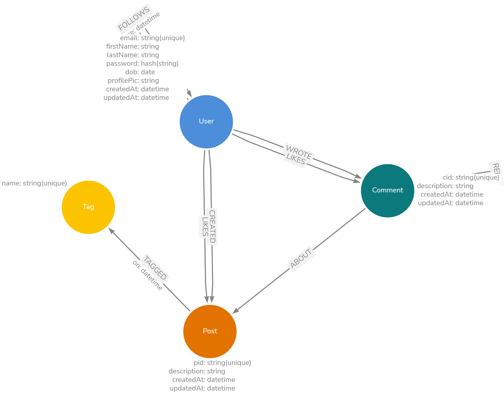

# Welcome to Neo4j Social!

A small social graph build on top of neo4j and [Remix](https://remix.run/) that mimics a real life application. It is made up of **Users** who **FOLLOW** each other to form a social network. **Users** can create **Posts**, **Comment** on posts on **Comment**, **LIKE** a **Post** or **Comment**. **Posts** can also have **Tags** .The application also provide some few recommendations like who to follow and more.



## Development

From your terminal:

```sh
npm install
```

```sh
npm run dev
```

This starts your app in development mode, rebuilding assets on file changes.
